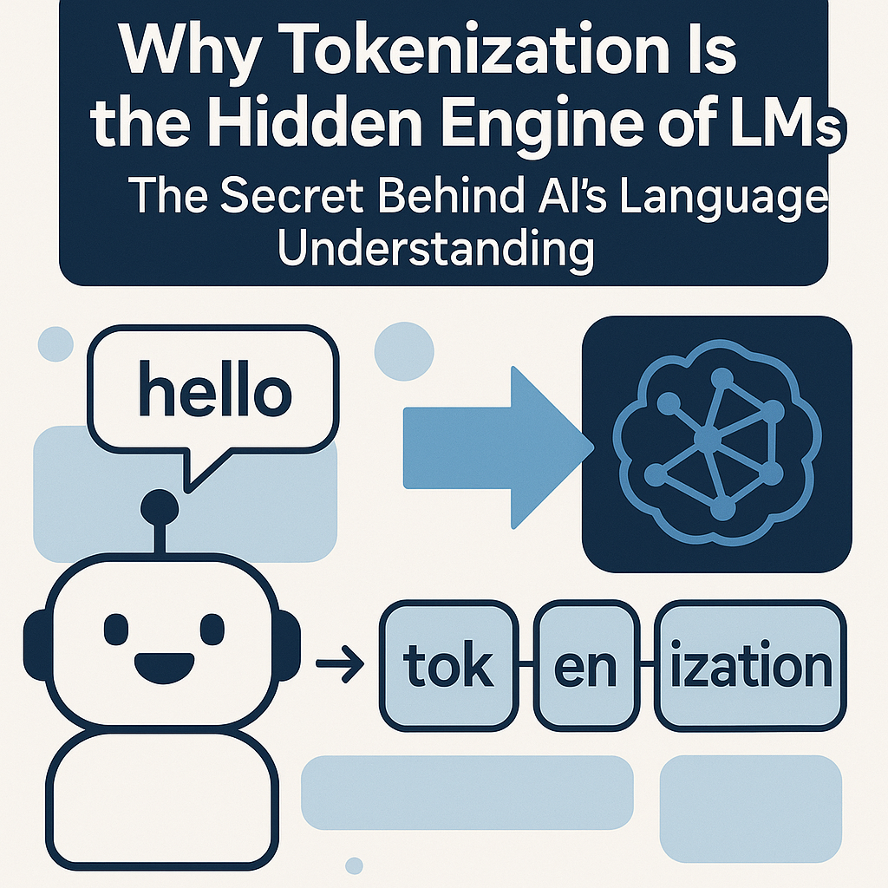
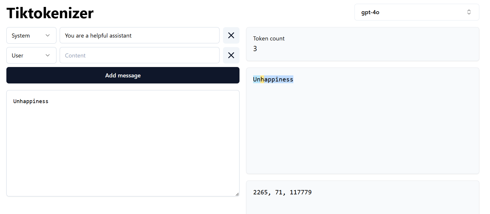

# Why Tokenization Is the Hidden Engine of LLMs: The Secret Behind AI's Language Understanding



Ever wondered how ChatGPT understands your messy typing, complete with typos 
and slang? Or how it can switch between coding Python and writing poetry in 
the same conversation? The answer lies in something most people have never 
heard of: **tokenization**, I persnoally am amazed on how it understands 
what I actually write, Those spelling mistakes and the awesome grammer in 
english that I write.

Think of tokenization as the translator that sits between human language and AI brains. Without it, asking an AI to "write me a story" would be like trying to explain calculus to your pet dog – technically possible, but highly ineffective, just kidding don't try that.

As a B.Tech student diving deep into AI, I've realized that tokenization isn't just a preprocessing step – it's literally the foundation that makes modern AI language models possible. Let me show you why this "boring" technical process is actually the most fascinating part of how AI works.

## What Exactly Is Tokenization? And Why Should You Care?

Let's start with a simple question: **How do you teach a computer to understand the word "hello"?**

Computers are basically very fast calculators. They only understand numbers, not letters. So when you type "hello" to ChatGPT, something magical happens behind the scenes – that word gets converted into numbers that the AI can actually work with.

This conversion process is called **tokenization**.

But here's where it gets interesting. AI doesn't just convert whole words to numbers. Instead, it breaks text into smaller chunks called "tokens." These tokens might be:
- Whole words: "hello" → one token
- Parts of words: "unhappiness" → ["un", "happy", "ness"]
- Even single characters: "AI" → ["A", "I"]

**But why break words apart?** Let me give you a real example that'll blow your mind.

## The Real Problem: Why Simple Word-to-Number Won't Work

Imagine you're building a simple system that just converts whole words to numbers:
- "run" = 1
- "running" = 2  
- "ran" = 3
- "runner" = 4

Looks simple, right? But what happens when someone types "runs"? Your system has never seen this word before, so it panics and says "UNKNOWN WORD."

Now multiply this by every possible word variation in English. You'd need millions of entries just for one language! And what about new words like "ChatGPT" or "blockchain"? Your system would be constantly confused.

This is exactly why modern AI uses **subword tokenization**.

## How Subword Tokenization Actually Work



The most popular method is called **Byte Pair Encoding (BPE)** :

### Step 1: Start with characters
Take the word "tokenization":
```
t-o-k-e-n-i-z-a-t-i-o-n
```

### Step 2: Find common pairs
The system notices that "to" appears often in training data, so it merges:
```
to-k-e-n-i-z-a-t-i-o-n
```

### Step 3: Keep merging common patterns
After many iterations:
```
token-iz-ation
```

Now when the AI sees "tokenization," it recognizes it as three familiar pieces: "token" + "iz" + "ation."

**Here's the genius part:** Even if the AI has never seen "tokenization" before, it understands it because it knows these smaller parts!

Let me show you this in action with Python code:

```python
# Simple tokenization example using a basic BPE-like approach
def simple_tokenize(text):
    # This is a simplified version - real tokenizers are much more complex
    common_subwords = [
        "un", "re", "ing", "ed", "tion", "ly", "er", "est", 
        "ness", "ment", "ful", "less", "able"
    ]
    
    tokens = []
    i = 0
    while i < len(text):
        # Try to find the longest matching subword
        found = False
        for length in range(min(6, len(text) - i), 0, -1):
            substring = text[i:i+length]
            if substring in common_subwords or substring.isalpha():
                tokens.append(substring)
                i += length
                found = True
                break
        if not found:
            tokens.append(text[i])
            i += 1
    
    return tokens

# Test it out
text = "unhappiness"
tokens = simple_tokenize(text)
print(f"'{text}' becomes: {tokens}")
# Output: 'unhappiness' becomes: ['un', 'happy', 'ness']
```

## Why This Changes Everything for AI

Now here's where tokenization becomes the "hidden engine" of LLMs:

### 1. **Vocabulary Efficiency**
Instead of storing millions of whole words, AI models work with around 50,000 tokens. These tokens can combine to create virtually any word in any language!

### 2. **Handling New Words**
When someone invents a new word like "metaverse," the AI doesn't panic. It breaks it down: "meta" + "verse" – parts it already understands.

### 3. **Multilingual Magic**
The same tokenizer can handle English, Spanish, Hindi, and even programming code! Here's why:

```python
english = "Hello world"      # → ["Hello", " world"]
spanish = "Hola mundo"       # → ["Hola", " mundo"]  
code = "print('hello')"      # → ["print", "('", "hello", "')"]
```

### 4. **Context Understanding**
Because tokens preserve meaning relationships, the AI understands that "run," "running," and "ran" are related through their shared "run" token.

## Real-World Impact: Where Tokenization Makes or Breaks AI

Let me share some examples of how tokenization directly affects AI behavior:

### Example 1: The Strawberry Problem
Ask ChatGPT "How many 'r's are in strawberry?" and it often gets it wrong. Why? Because "strawberry" might be tokenized as ["straw", "berry"], and the AI counts 'r's in tokens, not individual letters!

### Example 2: Math Problems
AI struggles with arithmetic partly because numbers get tokenized weirdly. "1234" might become ["12", "34"], making mathematical relationships harder to understand.

### Example 3: Code Generation
When GPT writes code, it's actually predicting the next token, not the next character. That's why it's so good at completing function names and following programming patterns.

## The Questions Everyone Asks ~ FAQ :

**Q: Does tokenization work the same for all languages?**
A: Nope, some languages are trickier. Chinese characters often become individual tokens, while German compound words get split into meaningful parts.

**Q: Can I see how my text gets tokenized?**
A: Absolutely! OpenAI has a tokenizer playground where you can paste text and see exactly how GPT breaks it down, Even i saw it recently so here is the Link for that : https://tiktokenizer.vercel.app/ , Have Fun!.

**Q: Why don't we just use characters instead of tokens?**
A: We could, but it would be incredibly inefficient. Processing "artificial intelligence" as 22 characters vs 2-3 tokens makes AI models much slower and less effective, let me give you an Example if i ask you to analyze a Entire word by character by character and word by word in this case Token by Token which one do you think will be quick you might understand both but which is faster if you say character by character then you should replace the ChatGPT itself.

**Q: Do different AI models use different tokenization?**
A: Yes! GPT-4, Claude, and LLaMA all use slightly different tokenization strategies, which partly explains why they have different strengths and weaknesses and why some models work fine for some cases and others wont is also somewhat related to this and other part is offtopic.

## The Bigger Picture: Why This Matters for Your Future

As an AI Engineer, understanding tokenization gives you superpowers:

1. **Debugging AI behavior**: When AI acts weird, check the tokenization first
2. **Optimizing prompts**: Knowing how your text gets tokenized helps you write better prompts
3. **Building better AI apps**: Understanding tokens helps you estimate costs and optimize performance

## The Hidden Engine Revealed

Tokenization might seem like a boring preprocessing step, but it's actually the bridge between human creativity and machine intelligence, if you know how a Compiler works then you can relate this to that. Every time you chat with an AI, write code with GitHub Copilot, or get help with homework from ChatGPT, tokenization is working silently in the background, making the magic possible.

The next time someone asks you how AI understands language, you can tell them: "It all starts with breaking words into meaningful pieces – and that simple idea powers everything."

Think about it: without tokenization, we wouldn't have ChatGPT, GitHub Copilot, or any of the AI tools we use daily. This "hidden engine" is literally powering the AI revolution happening right now and at very large scale.

## Acknowledgments and Development Notes

In the spirit of transparency and following best practices in AI education:

- ChatGPT was consulted for improving the technical explanations and examples in this blog post
- Cursor AI assisted in refining code examples and suggesting additional tokenization scenarios
- The diagrams and visualizations were created to illustrate the concepts discussed
- All content has been verified for technical accuracy and originality

This acknowledgment aligns with the project's emphasis on learning and proper attribution of AI assistance while maintaining the originality of insights and analysis.